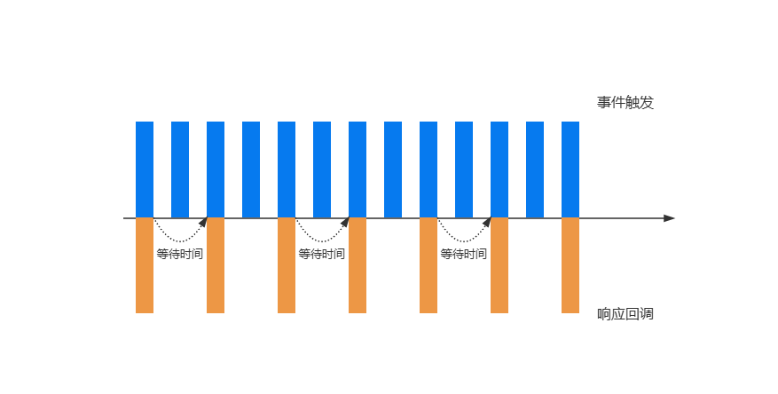

# JavaScript中的函数防抖(debounce)和函数节流(throttle)

### 前言
JavaScript是事件驱动的, 大量的操作如点击、页面滚动及input输入等等都会触发事件, 加入到事件队列中, 而对于一些频繁的事件触发会造成性能损耗, 那么就可以通过防抖和节流来限制事件频繁的发生。

## 防抖及应用
当事件触发时, 相应的回调不会立即执行, 而是会等待一定的时间才会执行。若事件触发的相当频繁, 那么对应的回调就会一直推迟执行, 只有等待了一段时间并且没有触发事件了, 才会真正的执行相应的回调, 这就是防抖。如图:


防抖的应用场景:
 - 浏览器缩放resize事件
 - 监听浏览器滚动事件, 完成某些操作
 - 输入框频繁的输入内容, 触发搜索

### 防抖函数基本实现
```javascript
function debounce(callback, delay) {
  let timer = null

  function _debounce() {
    if (timer) clearTimeout(timer)

    timer = setTimeout(() => {
      callback()
      timer = null
    }, delay)
  }

  return _debounce
}
```

### 优化this及参数
``` javascript
function debounce(callback, delay) {
  let timer = null

  function _debounce(...args) {
    if (timer) clearTimeout(timer)

    timer = setTimeout(() => {
      callback.apply(this, args)
      timer = null
    }, delay)
  }

  return _debounce
}
```

### 优化立即执行及取消功能
```javascript
function debounce(callback, delay, immediate) {
  let timer = null

  let invoke = false

  function _debounce(...args) {
    if (timer) clearTimeout(timer)

    if (!invoke && immediate) {
      callback.apply(this, args)
      invoke = true
      return
    }

    timer = setTimeout(() => {
      callback.apply(this, args)
      timer = null
      invoke = false
    }, delay)
  }

  _debounce.cancel = function () {
    if (timer) {
      clearTimeout(timer)
      timer = null
      invoke = false
    }
  }

  return _debounce
}
```

## 节流及应用
节流就是某个事件在一定时间内一直触发, 响应函数只会被触发一次。还是用一幅图来表示:


节流的应用场景:
- 游戏中的一些设计
- 监听鼠标移动事件
- 监听页面滚动事件

### 节流函数基本实现
```javascript
function throttle(callback, interval) {
  // 开始时间
  let startTime = 0

  function _throttle() {
    // 当前时间
    const nowTime = Date.now()
    // 等待时间
    const waitTime = interval - (nowTime - startTime)

    if (waitTime <= 0) {
      callback()
      // 更新开始时间
      startTime = nowTime
    }
  }

  return _throttle
}
```

### 优化this及参数
```javascript
function throttle(callback, interval) {
  // 开始时间
  let startTime = 0

  function _throttle(...args) {
    // 当前时间
    const nowTime = Date.now()
    // 等待时间
    const waitTime = interval - (nowTime - startTime)

    if (waitTime <= 0) {
      callback.apply(this, args)
      // 更新开始时间
      startTime = nowTime
    }
  }

  return _throttle
}
```

### 头部执行及尾部执行
```javascript
function throttle(callback, interval, {leading = true, trailing = true}) {
  // 开始时间
  let startTime = 0

  let timer = null

  function _throttle(...args) {
    // 当前时间
    const nowTime = Date.now()

    // 头部执行
    if (!leading && !startTime) startTime = nowTime

    // 等待时间
    const waitTime = interval - (nowTime - startTime)

    if (waitTime <= 0) {
      callback.apply(this, args)
      // 更新开始时间
      startTime = nowTime
      if (timer) {
        clearTimeout(timer)
        timer = null
      }
    }

    // 尾部执行
    if (trailing && !timer ) {
      timer = setTimeout(() => {
        callback.apply(this, args)
        timer = null
        startTime = !leading ? 0 : Date.now()
      })
    }
  }

  return _throttle
}
```

### 取消功能
```javascript
function throttle(callback, interval, {leading = true, trailing = true}) {
  // 开始时间
  let startTime = 0

  let timer = null

  function _throttle(...args) {
    // 当前时间
    const nowTime = Date.now()

    // 头部执行
    if (!leading && !startTime) startTime = nowTime

    // 等待时间
    const waitTime = interval - (nowTime - startTime)

    if (waitTime <= 0) {
      callback.apply(this, args)
      // 更新开始时间
      startTime = nowTime
      if (timer) {
        clearTimeout(timer)
        timer = null
      }
    }

    // 尾部执行
    if (trailing && !timer ) {
      timer = setTimeout(() => {
        callback.apply(this, args)
        timer = null
        startTime = !leading ? 0 : Date.now()
      })
    }
  }

  _throttle.cancel = function () {
    if (timer) {
      clearTimeout(timer)
      timer = null
      startTime = 0
    }
  }

  return _throttle
}
```

### 总结
防抖和节流很相似, 在开发过程中都是为了当某些事件频繁的触发时, 降低响应回调执行的频率, 优化一些性能开销。区别就在于防抖是延迟响应回调的执行, 节流则是让响应回调在规定时间内只执行一次