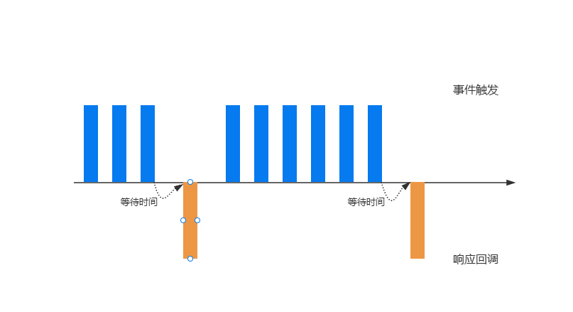

# JavaScript中的函数防抖和函数节流

### 前言
JavaScript是事件驱动的, 大量的操作如点击、页面滚动及input输入等等都会触发事件, 加入到事件队列中, 而对于一些频繁的事件触发会造成性能损耗, 那么就可以通过防抖和节流来限制事件频繁的发生。

## 函数防抖(debounce)
当事件触发时, 相应的回调不会立即执行, 而是会等待一定的时间才会执行。若事件触发的相当频繁, 那么对应的回调就会一直推迟执行, 只有等待了一段时间并且没有触发事件了, 才会真正的执行相应的回调。如图:


### 防抖函数基本实现
```javascript
function debounce(callback, delay) {
  let timer = null

  function _debounce() {
    if (timer) clearTimeout(timer)

    timer = setTimeout(() => {
      callback()
      timer = null
    }, delay)
  }

  return _debounce
}
```

### 优化this及参数
``` javascript
function debounce(callback, delay) {
  let timer = null

  function _debounce(...args) {
    if (timer) clearTimeout(timer)

    timer = setTimeout(() => {
      callback.apply(this, args)
      timer = null
    }, delay)
  }

  return _debounce
}
```

### 优化立即执行及取消功能
```javascript
function debounce(callback, delay, immediate) {
  let timer = null

  let invoke = false

  function _debounce(...args) {
    if (timer) clearTimeout(timer)

    if (!invoke && immediate) {
      callback.apply(this, args)
      invoke = true
      return
    }

    timer = setTimeout(() => {
      callback.apply(this, args)
      timer = null
      invoke = false
    }, delay)
  }

  _debounce.cancel = function () {
    if (timer) {
      clearTimeout(timer)
      timer = null
      invoke = false
    }
  }

  return _debounce
}
```

## 函数节流(throttle)